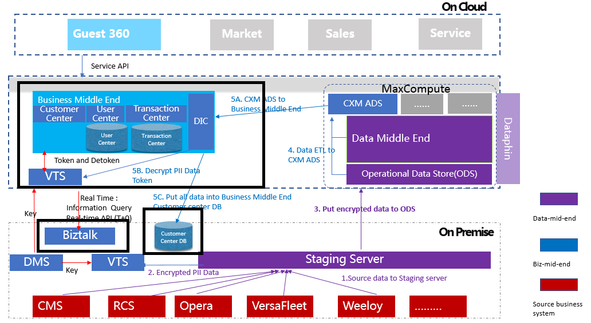
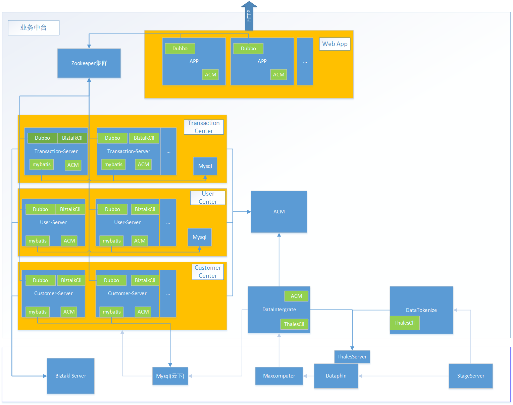

# RWS-CXM共享业务中台

### 项目介绍
|Maven工程结构|项目一级模块|项目二级模块(需独立打包)|模块说明|
|------------|-----------|----------------------|------|
|rwscxm|rws-core|rws-core.jar|基础公共框架包，与业务无关，打成jar|
||rwscxm-app|||前端应用层单独打jar包|
||rwscxm-customer||业务中台业务中心-客户中心-pom|
|||rwscxm-customer-interface.jar|业务中台业务中心-客户中心-dubbo接口定义|
|||rwscxm-customer-impl.jar|业务中台业务中心-客户中心-dubbo接口实现|
|||rwscxm-customer-server.jar|业务中台业务中心-客户中心-dubbo服务器,打成jar包部署到edas|
||rwscxm-transaction||业务中台业务中心-交易中心-pom|
|||rwscxm-transaction-interface.jar|业务中台业务中心-交易中心-dubbo接口定义|
|||rwscxm-transaction-impl.jar|业务中台业务中心-交易中心-dubbo接口实现|
|||rwscxm-transaction-server.jar|业务中台业务中心-交易中心-dubbo服务器,打成jar包部署到edas|
||rwscxm-user||业务中台业务中心-用户中心-pom|
|||rwscxm-user-interface.jar|业务中台业务中心-用户中心-dubbo接口定义|
|||rwscxm-user-impl.jar|业务中台业务中心-用户中心-dubbo接口实现|
|||rwscxm-user-server.jar|业务中台业务中心-用户中心-dubbo服务器,打成jar包部署到edas|
||rwscxm-dataintergration|rwscxm-dataintergration.jar|业务中台-数据集成中心,打成jar包，部署在edas。用于解密dataphin数据,并同步到客户中心的数据库|
||rwscxm-datatokenization|rwscxm-datatokenization.jar|加密程序-单独打成jar包发送给客户部署，用于加密stageserver数据


###总图(业务中台为黑色框框部分)


###业务中台


### 技术概述

|Name|Description|
|-|-|
|SpringBoot|零配置|
|SpringMVC|Web端|
|SpringBatch|job流程|
|Mockito|Test|
|Mybatis|ORM框架|
|Dubbo|微服务框架|
|Mysql|关系型数据库|
|Maxcomputer|数据库=(阿里的离线计算服务)|
|SonarLint|代码规范|
|Zookeeper|微服务注册仓库|
|docker|jar包会打包成docker镜像|
|kubernetes|容器编排|


#### SpringBoot
> 1.功能性的类都不通过手动new方法创建

> 2.使用注解代替xml文件:

> 
|Name|Description|
|-|-|
|@Component||
|@Service||
|@Configuration|工厂类(相当于一个xml文件)|
|@Bean|相当于xml文件中的<bean/>|
|@ConfigurationProperties||
|@Autowird||
|@Qualifier||
|@Primary|非单例情况下默认实例|

#### SpringMvc
	cxm-app工程使用

#### Mybatis

> 1.仓库声明

	使用@Mapper+@Component生命interface

> 2.sql实现:

>> a.参数:@Param

>> b.简单sql:@Select/@Update/@Delete

>> c.复杂sql:这里使用@SelectProvider/@UpdateProvider/@DeleteProvider而不用mapper.xml文件

>> d.分页查询: 
```
PageHelper.starPage(pageNum, pageSize);
List<XXX> XXX = xxxMapper.selectList();
```

#### Dubbo
> 1.接口定义: 定义在功能模块的xxx-interface工程内

> 2.接口实现: 定义在功能模块的xxx-impl工程内。实现类使用\@com.alibaba.dubbo.config.annotation.Service装饰

> 3.接口使用: 引用xxx-interface工程,接口使用\@com.alibaba.dubbo.config.annotation.Reference装饰


#### Mockito
	单元测试

#### Application Configuration Manager(阿里云提供的应用配置管理功能)
	
####修改配置的方式:

>1.项目resource目录下:
```
	application-dev.yml
	application-sit.yml
	application-uat.yml
	application-prod.yml
	application.yml

```

>application.yml:
```
spring:
	profiles:
		active: @profileActive@
		#application-dev.yml
		#active: dev
```			

> 2.登陆阿里云edas的应用配置->修改对应项目的配置文件(properties配置)

### 对接的外部服务

#### BizTalk(CMS/RCS/Opera)

>	业务中台的大部分数据都是来源于外部，这些外部数据中的大部分都通过数据集成中心预先同步到业务业务中台的数据库中,仍剩余一小部分需要通过时实接口的方式获取。

> 接口: ExternalSystemService.java

> 1.需要单次调用单个接口		

> 2.需要多次调用多个接口: 参考ExternalSystemService#asyncCall的并发调用

### Thales(datatokenize/dataintergrate)

	加解密接口